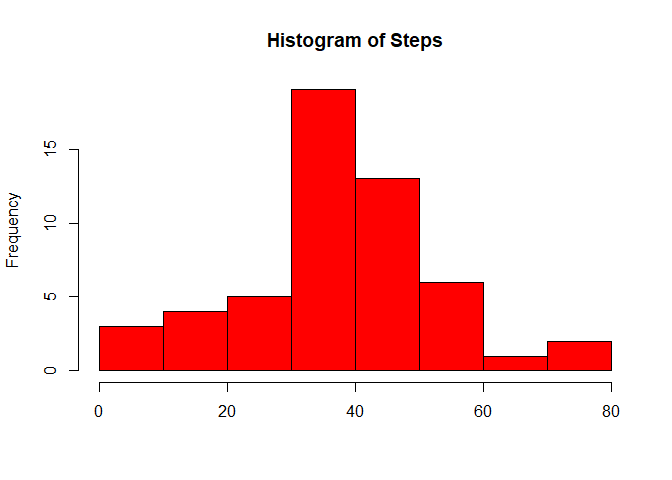
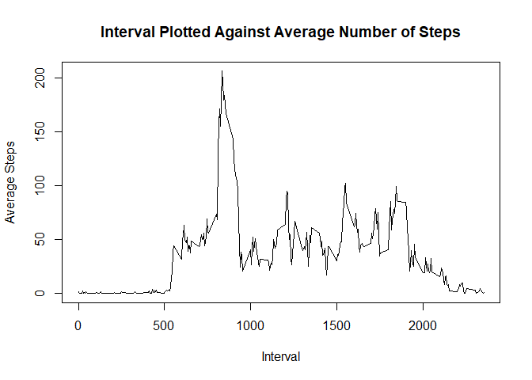
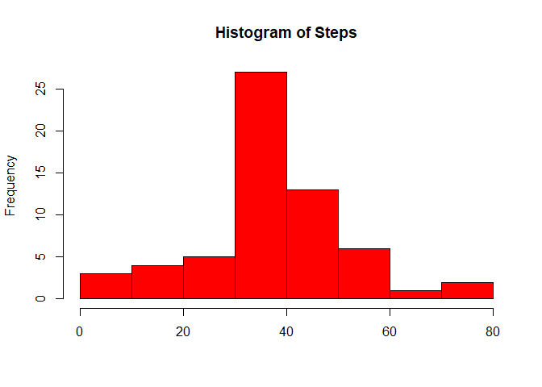
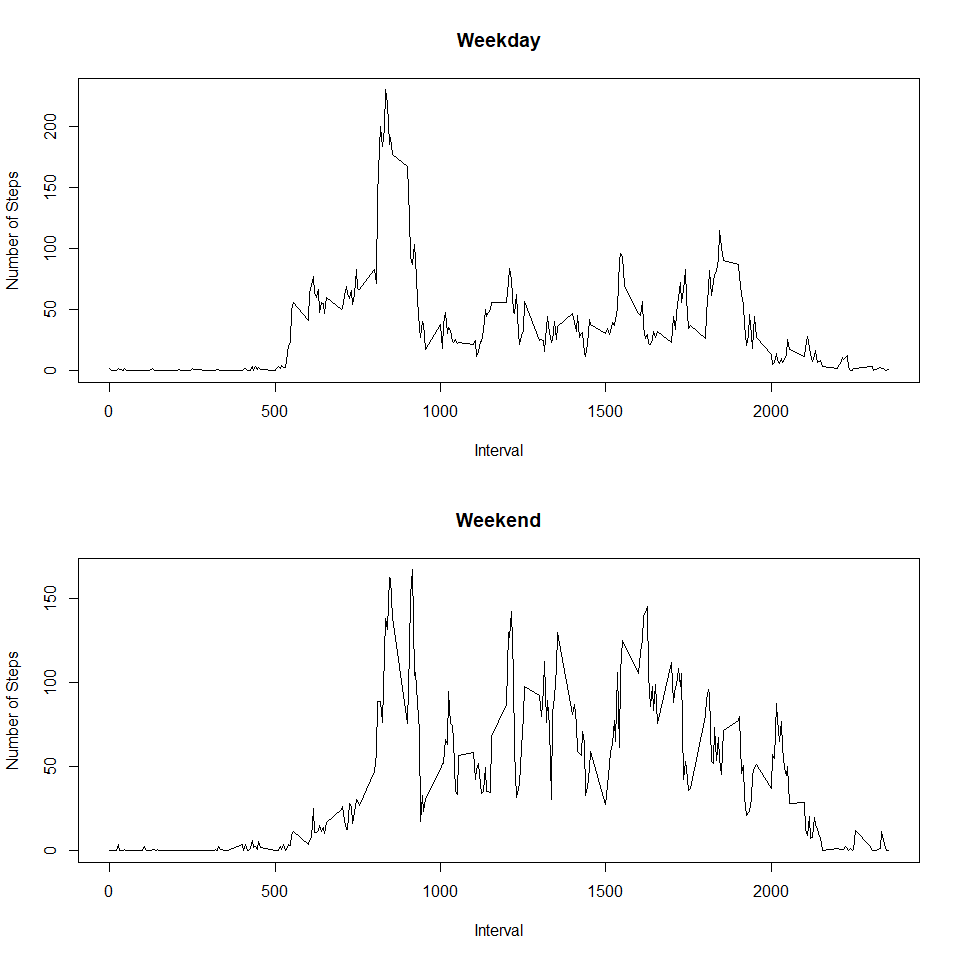

## Loading and preprocessing the data


```r
## Loading packages
library(dplyr)
library(ggplot2)
library(data.table)
library(timeDate)

## Unpacking data
unzip('activity.zip', c("activity.csv"))
data <- read.csv("activity.csv")
data<-data.table(data)
```

## What is mean total number of steps taken per day?

### Plotting Histogram


```r
data_grouped<-data[,mean(steps,na.rm=T),by=date]
hist(data_grouped$V1,col="red",xlab="",main="Histogram of Steps")
```

<!-- -->

### Calculation of mean and median


```r
mean<-mean(data_grouped$V1,na.rm=T)
median<-median(data_grouped$V1,na.rm=T)
```

The mean is 37.3825996 and the median is 37.3784722.

## What is the average daily activity pattern?


```r
avg_data<-data[,mean(steps,na.rm=T),by=interval]
plot(avg_data$interval,avg_data$V1,xlab="Interval",type="l", ylab="Average Steps",
     main="Interval Plotted Against Average Number of Steps")
```

<!-- -->


```r
max_steps <- filter(avg_data, avg_data$V1==max(avg_data$V1))$interval
```

The interval containing the max number of averaged steps is 835

## Imputing missing values


```r
na_count = sum(is.na(data))
```

There are 2304 missing values in the dataset.

Missing values of steps will be replaced by the mean of the corresponding interval. A new dataset will be created that
is equal to the original dataset but with missing values filled in.


```r
joined_data <- left_join(data, avg_data, by="interval")
joined_data$steps[is.na(joined_data$steps)] <- joined_data$V1[is.na(joined_data$steps)]
joined_data$V1 <- NULL
filled_data <- data.table(joined_data)
```

Next, we'll create a histogram with the filled in dataset according to the method of the histogram made earlier:

### Plotting Histogram


```r
data_grouped<-filled_data[,mean(steps,na.rm=T),by=date]
hist(data_grouped$V1,col="red",xlab="",main="Histogram of Steps")
```

<!-- -->

### Calculation of mean and median


```r
mean_filled<-mean(data_grouped$V1,na.rm=T)
median_filled<-median(data_grouped$V1,na.rm=T)
```

The mean is 37.3825996 and the median is 37.3825996.

The histogram shows the same pattern for both datasets, althought the exact numbers diverge slightly.
The means are the same (which makes sense as we used the means to fill the missing values). The medians also diverge
slightly. Conclusively: the changes to the dataset by filling in the NA's can be considered negligble. However,
as more observations are almost always favoured when applying machine learning techniques, filling in the blanks
is worth the trouble.

## Are there differences in activity patterns between weekdays and weekends?

### Creating wDay column indicating difference between weekdays and weekends:


```r
library(timeDate)
# Creating character vector containing Dutch weekdays.
weekdays1 <- c('maandag', 'dinsdag', 'woensdag', 'donderdag', 'vrijdag')
# Using new vector to create a new column contaning weekday vs weekend info.
filled_data$wDay <- factor((weekdays(as.Date(filled_data$date)) %in% weekdays1), 
         levels=c(FALSE, TRUE), labels=c('weekend', 'weekday'))
```

### Panel plot: interval vs steps for weekdays and weekends:


```r
## Subset weekdays and weekends in two different data sets
weekday <- filter(filled_data, wDay=='weekday')
weekend <- filter(filled_data, wDay=='weekend')

## Convert to data table
weekday <- data.table(weekday)
weekend <- data.table(weekend)

## Set parameters for figure
par(mfrow=c(2,1))

## Calculate averages and plot for weekdays
avg_weekday<-weekday[,mean(steps,na.rm=T),by=interval]
avg_weekday<-avg_weekday[order(avg_weekday$interval)]
plot(as.numeric(avg_weekday$interval),avg_weekday$V1,xlab="Interval",type="l", 
     ylab="Number of Steps",main="Weekday")

## Calculate verages and plot for weekends
avg_weekend<-weekend[,mean(steps,na.rm=T),by=interval]
avg_weekend<-avg_weekend[order(avg_weekend$interval)]
plot(as.numeric(avg_weekend$interval),avg_weekend$V1,xlab="Interval",type="l", 
    ylab="Number of Steps",main="Weekend")
```

<!-- -->

### Conclusion

There is a difference in activity patterns between weekdays and weekends. There appears to be more activity in
weekends. The activity in weekends is also more voltaile than during weekdays.
